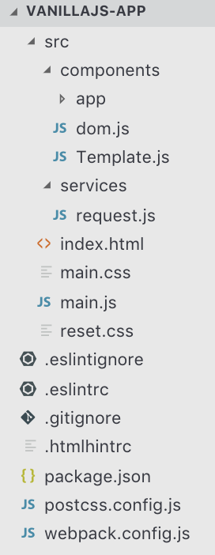

### Template for VanillaJS Apps

Create a directory, for example at `~/templates`, for storing project templates.
Then add a directory that holds your template:

```sh
> mkdir ~/templates
> mkdir ~/templates/vanillajs-app
``` 

Create or copy your assets into this directory. My looks like this:



Open up your bash profile (or create if doesn't exist):

```sh
> code ~/.bash_profile
```

Add an alias somewhere in the file:

```sh
alias mkvanilla="cp -R ~/templates/vanillajs-app/ ./ && npm i"
```

Now when you are in a directory you can copy in the template (and install dependencies) via:

```sh
myproject> mkvanilla
``` 

## Serverless

### Setup

1. Get a Google account if you don't already have one.
1. Open your [Firebase Dashboard](https://console.firebase.google.com/)
1. Add a project
1. Choose `Database` on the left, then add `Realtime Database`.
1. Choose Settings wheel and scroll down to "Add Firebase to my web app". Copy the JavaScript for
config object and paste to `firebase.js`
1. Choose `Database` from the right menu, then choose the `Rules` tab. Set `read` and `write` access to true in fb console (for now! we will cover auth next week!)
1. Configure client-side (app) service for accessing firebase
  1. Install firebase SDK: `npm i firebase`
  1. See `src/services/firebase.js` for setup
1. Choose `Storage` from the right menu, then choose add.
1. In `Rules` tab for `Storage`,  set `read` and `write` access to true in fb console (for now! we will cover auth next week!)