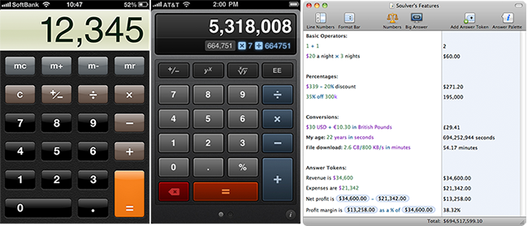

# Devsign Notes, Budget Tracker Lab

## UX Strategy

You aren't expected to formally complete the UX Strategy process due to lack of time, but you should discuss the following questions with your partner as you sketch your Budget Tracker layout.

* **Who is this app for?** 
* **What are the use circumstances for different types of users?**
* **Who is the competition?**

   There's a lot of budget tracking apps out there already–there's 25 listed here at [Best Budgeting and Personal Finance Apps](https://www.tomsguide.com/us/pictures-story/548-best-budget-expense-apps.html#s2). Think about

   * What features are common to the highest-rated budgeting apps?
   * What distinguishes a usable app from a quickly abandoned one?

___

## Accessibility

As you develop, keep your eye on the [React Accessibility Docs](https://reactjs.org/docs/accessibility.html). It's a valuable collection of checklists and resources.

Because React is new to us, it's easy to forget to apply principles we've already covered, such as

### Skip to desired content

* [Skip Navigation Links](https://webaim.org/techniques/skipnav/) for screen readers
* [Landmark Roles](https://dequeuniversity.com/assets/html/jquery-summit/html5/slides/landmarks.html)

### Accessible forms

* Review and apply [How to structure an HTML form](https://developer.mozilla.org/en-US/docs/Learn/HTML/Forms/How_to_structure_an_HTML_form) at MDN
* Note that JSX uses `htmlFor` in place of `for`:

   ```
   <label htmlFor="userName">Name:</label>
   <input id="userName" type="text" name="name"/>
   ```

* The [eslint-plugin-jsx-a11y](https://github.com/evcohen/eslint-plugin-jsx-a11y) plugin recommends using `for` (or in this case, `htmlFor`) **AND** nesting the form widget within a `label`, **not** one or the other:

   ```
   <label htmlFor="userName">
     Name: <input type="text" id="userName" name="name"/>
   </label>
   ```

### Document `<title>`

* In the React labs we've built so far the `<title>` tends to remain unchanged from its initial declaration in `index.html`. 

* In a complex app, however, updating the `<title>` can keep the user aware of changes in context.

* For a more dynamic `<title>`, check out the [React Document Title Component](https://github.com/gaearon/react-document-title).

### Accessibility Development Assistance

* The [eslint-plugin-jsx-a11y](https://github.com/evcohen/eslint-plugin-jsx-a11y) plugin for ESLint checks [A11y Project](https://a11yproject.com/checklist.html) accessibility rules on JSX elements. 

___

## The Design Process

As you make rough sketches in your notebook or on the whiteboard, you're trying to solve three things:

1. **The page layout.** Start with mobile legibility first and work your way outward.

1. **The component architecture.** What components will be necessary, and when?

1. **The semantic HTML markup** used to display content. Planning this out ahead of time will help you build more meaningful components.

### Your User Interface

* When considering your app's visual style, remember that skeuomorphic visual references to familiar real-world processes can sometimes **minimize the need for instructions**.



* Flat design is fine, as long as you don't **erase functionality** cues from your UI.

* Unsure which UI Pattern is appropriate? Review [User Interface Design Patterns](http://ui-patterns.com/patterns).

___

## PostCSS Variables

* If you want to keep your PostCSS variables in an *external* file, as we did in part one of the DevSign course, you'll need to install [postcss-import](https://github.com/postcss/postcss-import).

* This will then be required **first** in your `postcss.config.js` file:

   ```
   /* eslint-env node */
   module.exports = {
     plugins: [
       require('postcss-import'),
       require('precss'),
       require('autoprefixer')
     ]
   };
   ```

* [Responsive Typography](https://www.smashingmagazine.com/2016/05/fluid-typography/) is doable in React, but advisable only for apps with lots to read. You'll want more precise control for this lab.
___

## CSS Grid

Not a lot of best practice documentation exists yet on combining [CSS Grid](https://css-tricks.com/snippets/css/complete-guide-grid/) with React.

When combined with [Flexbox](https://css-tricks.com/snippets/css/a-guide-to-flexbox/), CSS Grid is still the most powerful responsive layout tool we have. Just be sure to

* **Plan your components** that use Grid carefully. Remember, there is no support yet for subgrids.

* **Avoid flattening markup** to achieve grid goals. Keep your HTML semantic!